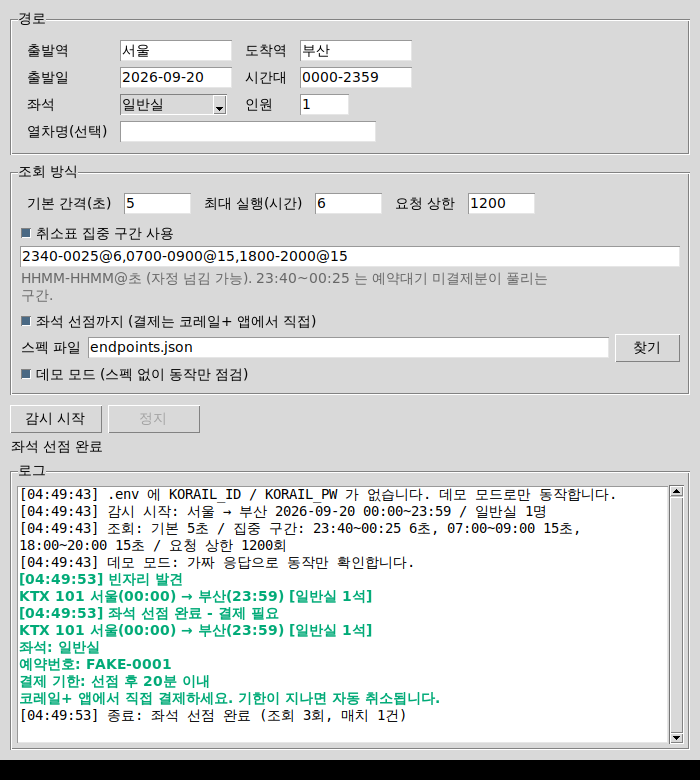

# korail-watch

코레일+ 열차의 빈자리를 저빈도로 감시해 알려주고, 원하면 **좌석 선점까지만** 수행하는 도구.
결제는 하지 않는다. 선점된 좌석은 코레일+ 앱에서 직접 결제해야 하며, 기한(약 20분)이
지나면 자동 취소되어 다른 사람에게 돌아간다.

## 왜 이 형태인가

- **결제 자동화 제외.** 코레일은 2025년 7월 매크로 탐지 솔루션 도입 이후 하루 평균 1.6만 건을
  차단하고 있고, 명절 승차권 매크로 예매자가 컴퓨터등장애업무방해로 검찰에 송치된 사례가 있다.
  대량 선점·재판매가 문제의 핵심이므로, 이 도구는 1건 감시·1건 선점에서 멈춘다.
- **차단 신호를 만나면 우회하지 않고 중단한다.** 401/403/429나 응답 본문의 매크로 탐지 문구를
  만나면 즉시 종료한다(`BlockedError`). IP 로테이션, 기기 지문 위조, CAPTCHA 우회는 넣지 않았고
  넣을 계획도 없다.
- **간격 하한 5초 + 요청 예산.** 사람이 앱에서 엄지로 새로고침하는 속도가 하한이다.
  그 아래는 `PollerConfig`가 거부한다. 간격을 좁힐수록 총 요청 상한(기본 1,200회)이
  먼저 걸리는 브레이크로 작동한다.

## 먼저 확인할 것

**예약대기가 걸리면 그걸 쓰는 게 항상 낫다.** 매진 열차에 출발 2일 전까지 신청해두면 반환석
발생 시 자동 예약되고 SMS가 온다. 공식 기능이 하는 일을 폴링으로 대신할 이유는 없다.

이 도구는 예약대기가 **안 걸리는** 경우를 위한 것이다. 출발 2일 이내, 대기 정원이 찬 열차,
입석·자유석이 남아 매진으로 분류되지 않는 열차 등이 그렇다. 그런 열차의 취소표를 노린다.

## 취소표를 실제로 잡으려면

취소표는 나온 뒤 수십 초 안에 사라진다. 설계상 두 가지가 따라온다.

1. **`--reserve` 가 사실상 필수다.** 알림을 받고 앱을 열어 손으로 예매하면 대개 늦는다.
   선점까지 자동으로 하고 결제만 사람이 하는 구조라야 의미가 있다.
2. **종일 연타가 아니라 몰리는 시간대에 좁게.** 취소표는 균등하게 나오지 않는다.
   `--cancel-hunt` 가 기본 집중 구간을 적용한다.

| 구간 | 간격 | 근거 |
|---|---|---|
| 23:40~00:25 | 6초 | 예약대기 배정분의 결제 기한이 당일 24시. 미결제 건이 자정 직후 한꺼번에 풀린다 (코레일 공지 기준) |
| 07:00~09:00 | 15초 | 출근 시간대 당일 일정 변경 취소 — 경험적 추정 |
| 18:00~20:00 | 15초 | 퇴근 시간대 동일 — 경험적 추정 |

자정 구간만 공지에 근거한 값이고 나머지 둘은 추정이다. 본인 노선의 실제 기록을 보고
`--windows` 로 조정하는 편이 낫다. 이 방식이 종일 5초 연타보다 적중률이 높다 —
요청 수는 1/10인데 취소표가 나오는 순간에는 더 촘촘히 보고 있기 때문이다.

## 1단계: API 파악 (직접 해야 하는 부분)

> **PC 웹으로 하면 훨씬 쉽다.** KTX·SRT 통합 예매는 `www.korail.com` 에서도 되므로
> 크롬 개발자도구로 기록하면 끝이다. 에뮬레이터·인증서·피닝 우회가 필요 없다.
> → **[docs/capture-guide.md](capture-guide.md)** 를 따를 것. 아래 앱 캡처 방법은
> 웹으로 안 될 때의 대안이다.

`코레일+`는 2026년 8월 출시된 통합 앱이라 공개된 API 래퍼가 없다. 기존 오픈소스
(`carpedm20/korail2`, `ryanking13/SRT`, `lapis42/srtgo`)는 전부 구 letskorail·SRT 엔드포인트
기준이고 모두 아카이브·방치 상태다. 그래서 이 저장소에는 URL이 하드코딩돼 있지 않다.
직접 캡처한 값을 `endpoints.json`에 채워야 동작한다.

1. Android 에뮬레이터(예: Android Studio AVD, Google Play 이미지가 아닌 것)에 코레일+ 설치
2. mitmproxy 실행 → 에뮬레이터 Wi-Fi 프록시를 호스트:8080으로 설정
3. mitmproxy CA 인증서를 **시스템 인증서**로 설치 (사용자 인증서는 앱이 무시할 수 있음)
4. 앱에서 로그인 1회, 열차 조회 1회, (선택) 좌석 선점 1회를 수행하고 흐름을 기록
5. 각 요청의 URL·헤더·본문 필드명과 응답 JSON 구조를 `endpoints.json`에 옮겨 적는다

인증서 피닝에 막힐 수 있다. 그 경우는 여기서 멈추고 알림 없이 예약대기 기능을 쓰는 편을 권한다.
피닝 우회는 이 저장소의 범위 밖이다.

## 2단계: 설정

```bash
pip install -e ".[dev]"
cp endpoints.example.json endpoints.json   # 캡처한 값으로 채우기
cp .env.example .env                       # KORAIL_ID / KORAIL_PW
python3 scripts/kakao_setup.py --key …       # 카카오톡 알림 → docs/kakao-setup.md
python3 scripts/telegram_setup.py --token …  # 텔레그램 알림 → docs/telegram-setup.md
```

`.env`와 `endpoints.json`은 `.gitignore`에 있다. 자격증명을 커밋하지 말 것.

### endpoints.json 구조

| 키 | 설명 |
|---|---|
| `base_url` | 캡처한 API 호스트 |
| `headers` | 앱의 User-Agent 등 공통 헤더 |
| `login.json` | 로그인 요청 본문. `{login_id}` `{password}` 치환 |
| `login.token_path` | 응답에서 토큰을 꺼낼 점 경로 (`data.accessToken`) |
| `search.json` | 조회 요청 본문. `{dep_station}` `{arr_station}` `{date}` `{time}` `{passengers}` 치환 |
| `search.list_path` | 응답에서 열차 배열 경로 (`data.trainList`) |
| `search.fields` | 열차 1건의 필드명 매핑 |
| `search.seat_fields` | 좌석 종류 → 잔여석 필드명. 숫자면 그대로, `예약가능` 같은 상태 문자열이면 요청 인원만큼으로 계산 |
| `reserve.*` | 좌석 선점. 없으면 알림 전용으로 동작 |

치환 문자열이 값 전체면 타입이 보존된다(`"{passengers}"` → `2`).

## 3단계: 실행 (GUI)

```bash
korail-watch-gui
```



- **경로**: 출발/도착역, 출발일(`2026-09-20`, `20260920`, `0920` 모두 허용), 시간대, 좌석, 인원
- **조회 방식**: 기본 간격, 집중 구간, 요청 상한, 선점 여부, 스펙 파일 경로
- **데모 모드**: `endpoints.json` 없이 알림·선점 흐름만 확인
- 입력값은 `.korail-watch-gui.json` 에 저장되어 다음 실행 때 복원된다 (자격증명 제외 — 그건 `.env`)
- **정지** 버튼은 긴 대기 중에도 즉시 먹힌다 (`stop_event.wait` 로 자므로)
- 빈자리를 찾으면 로그가 강조되고 벨이 울리며 창이 앞으로 온다. 선점에 성공하면 팝업이 뜬다

tkinter 가 없으면 안내 메시지가 뜬다. `sudo apt install python3-tk` (Debian/Ubuntu),
`brew install python-tk` (macOS), Windows 는 설치 시 tcl/tk 옵션.

## 3단계(대안): 실행 (CLI)

```bash
# 취소표 사냥 (권장 형태)
korail-watch --dep 서울 --arr 부산 --date 2026-09-20 --time 0900-1330 \
  --cancel-hunt --reserve

# 집중 구간 직접 지정
korail-watch --dep 서울 --arr 부산 --date 2026-09-20 \
  --windows "2340-0025@6,1200-1230@8" --reserve

# 알림만
korail-watch --dep 서울 --arr 부산 --date 2026-09-20 --time 0900-1330 --passengers 2

# 스펙 없이 알림 경로만 점검
korail-watch --dep 서울 --arr 부산 --date 2026-09-20 --demo
```

| 옵션 | 기본값 | 설명 |
|---|---|---|
| `--interval` | 45초 | 집중 구간 밖의 간격. 최소 5초 |
| `--windows` | 없음 | `HHMM-HHMM@초` 쉼표 구분. 자정 넘는 구간 가능 |
| `--cancel-hunt` | - | 기본 집중 구간 프리셋 |
| `--reserve` | 꺼짐 | 빈자리 발견 시 선점까지 (결제 제외) |
| `--max-hours` | 6 | 총 실행 시간 |
| `--max-requests` | 1200 | 총 조회 요청 상한 |
| `--trains` | 전체 | `KTX,SRT` 처럼 열차명 제한 |

## 종료 사유

| 사유 | 의미 |
|---|---|
| `좌석 선점 완료` | 예약번호 발급. 앱에서 결제할 것 |
| `최대 실행 시간 도달` | 정상 종료 |
| `차단 신호 감지 - 중단` | 403/429 또는 탐지 문구. **재실행하지 말고 원인을 볼 것** |
| `연속 오류 한도 초과` | 5회 연속 실패(지수 백오프 30초→최대 10분) |
| `요청 예산 소진` | `--max-requests` 도달. 간격을 늘리거나 구간을 좁힐 것 |
| `복구 불가 오류` | 로그인 실패 또는 스펙 오류 |

## 구조

| 파일 | 역할 |
|---|---|
| `korail_watch/models.py` | `Train`, `WatchCriteria`(매칭 규칙), `Reservation` |
| `korail_watch/api.py` | 스펙 구동 HTTP 클라이언트. 결제 메서드 없음 |
| `korail_watch/cadence.py` | 시간대별 조회 간격, 간격 하한 |
| `korail_watch/poller.py` | 지터 폴링, 요청 예산, 백오프, 차단 시 중단, 알림 쿨다운 |
| `korail_watch/notify.py` | 콘솔 / 카카오톡 / 텔레그램 |
| `korail_watch/sources.py` | `TrainSource` 프로토콜과 테스트용 가짜 소스 |
| `korail_watch/forms.py` | GUI 입력 검증 → RunSpec (위젯 없이 테스트 가능) |
| `korail_watch/gui.py` | tkinter 창, 워커 스레드, 큐 펌프 |
| `korail_watch/cli.py` | 인자 파싱, 조립 |
| `scripts/scrub_har.py` | HAR 에서 비밀번호·개인정보 제거 |
| `scripts/telegram_setup.py` | 텔레그램 알림 확인·저장 |
| `scripts/kakao_setup.py` | 카카오톡 알림 인증·저장 |
| `korail_watch/envfile.py` | `.env` 읽기/쓰기 (토큰 갱신용) |

```bash
pytest              # 164 tests (GUI 테스트는 tkinter 없으면 skip)
xvfb-run -a pytest  # 헤드리스에서 GUI 테스트까지
```

네트워크 없이 전부 돈다. HTTP 계층은 `httpx.MockTransport`로, 폴링 루프는 가상 시계로,
GUI는 실제 Tk 창을 띄워 검증한다.

## 하지 않는 것

암표 거래, 대량 선점, 탐지 회피, 결제 자동화. 상업적 이용도 대상이 아니다.
